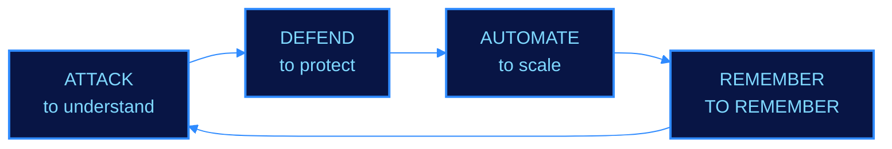
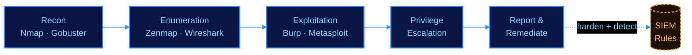
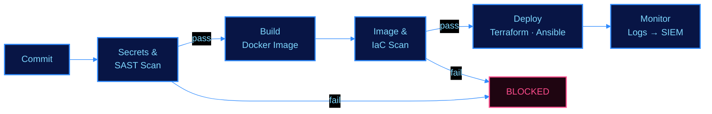
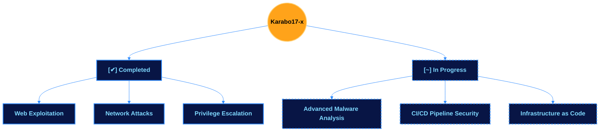
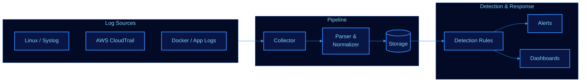

<div align="center" style="background:#000;padding:2rem;font-family:'Courier New',monospace;color:#00ff41;">


# Karabo17-x


</div>

---

```bash
root@karabo17x:~# whoami
name      : Karabo Mothapo
role      : Security Engineer @ Eclipse Softworks
status    : MWR CyberSec Internship — COMPLETED ✔
location  : South Africa 
objective : Breaking systems to secure them, automating how they're built
project   : Building SIEM
focus     : Cybersecurity + DevOps
```

### ⬡ Mindset Loop



---

##  Cyber Arsenal

|  Offensive |  Defensive |
|---|---|
| SQLi · XSS · CSRF · SSRF | SIEM Monitoring |
| Recon & Enumeration | Threat Detection |
| Exploit Development | System Hardening |
| Network Exploitation | Risk Mitigation |

```
[✔] Burp Suite   [✔] Metasploit   [✔] Nmap
[✔] Wireshark    [✔] Gobuster     [✔] Zenmap
```

<p align="center">
  
</p>

### ⬡ Engagement Flow



---

## ⚙ DevOps Arsenal

|  CI/CD & Automation |  Infra & Cloud |
|---|---|
| Jenkins · GitHub Actions | AWS (EC2, IAM, S3, VPC) |
| Docker · Container Hardening | Terraform (IaC) |
| Ansible Playbooks | Kubernetes (learning) |
| Shell/Bash Scripting | Log Aggregation & Monitoring |

```
[✔] Docker       [✔] Terraform    [✔] Ansible
[✔] Jenkins      [~] Kubernetes   [✔] GitHub Actions
```

<p align="center">
  
</p>

> Security-minded DevOps: pipelines that fail closed, infra that's hardened by default, and logs that actually get watched.

### ⬡ Fail-Closed Pipeline



---

## ⬡ Active Targets

```
[✔] Web Exploitation
[✔] Network Attacks
[✔] Privilege Escalation
[~] Advanced Malware Analysis   ← in progress
[~] CI/CD Pipeline Security     ← in progress
[~] Infrastructure as Code      ← in progress
```



---

##  Completed Programs

<p align="center">
  
</p>

---

##  Current Project: SIEM Build



---

##  Threat Intel

<p align="center">
  <a href="https://tryhackme.com/karabocollenm">
    
  </a>
  <a href="https://hackthebox.com/karabo17x">
    
  </a>
</p>

---

##  Connect

<p align="center">
  <a href="https://github.com/karabo17-x">
    
  </a>
</p>

---

```
> Attack to understand. Defend to protect. Automate to scale. REMEMBER TO REMEMBER.
```
